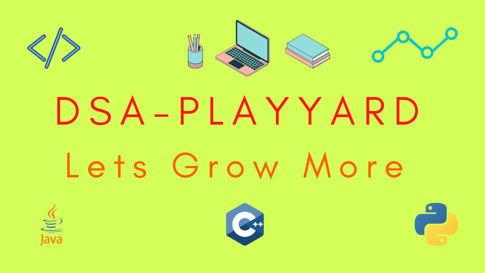

Hey Everyone! 👋 ****DSA- PlayYard**** is the first open source project of Lets Grow More Community. It is the perfect place to start with or to test your DSA Skills.

This Project contains all the basic and important topics of DSA so what are you waiting for Contribute to the project, and submit the solutions and have a chance to be featured as Contributor in this project.


Watch this video before contributing to DSA-Play yard Happy Coding! 🙂
 https://youtu.be/Ff38VOjv1no
# Project Structure 

Out of all the folders and files, you'll be able to see the 'Topic Wise Folders'. For example, "Arrays", "Linked List", etc. These folders are our major concern. Now, lets understand the structure of each of these folders. For explanation purpose, we'll consider the example of "Arrays" folder.

* On opening the "Arrays" folder, there will be ONYL FOUR files/folders : 3 folders (C++, Java, Python) and 1 'README.md' file.
* The 'README.md' file will contain the questions serial number wise (along with links). On clicking the question, you'll be redirected to where there is proper       explanation for the question.
* These questions are the ONLY QUESTIONS that you can solve and provide your solution for in the language of your choice (C++, Java, Python).
<br>
NOTE : The questions can be added ONLY BY MENTORS.
<br>

# Workflow of the entire process

* As soon as the mentors add new questions in the README.md of any particular topic folder, they also open an issue for that question. 
* This clearly means that no participant is supposed to open an issue for the questions. ONLY MENTORS CAN OPEN AN ISSUE FOR A QUESTION. 
* You as participant have to go on the issue of the question you wish to solve -> ask the mentors to assign you this issue. Make sure to mention the language in which you'd like to code otherwise the mentors won't be able to assign you the issue.

# How can participants suggest questions for a particular topic ?

* There is a file named as "Suggested Questions". 
* This file is created specially for the participants. If you want to contribute a code for a particular question which is not in the list of questions for which you can provide solution for, you can suggest the question in this file maintaining the serial number (add the link if possible).
* You should also mention the topic under which you want the question to be added.
* The mentors will regularly review these suggested questions. If they will find a particular question suitable to be added in the topic mentioned, he/she will add it in the README.md file of that particular topic folder. 
* Now, once this question is added, the mentor will also open an issue for this question.
* So, now you can go and ask to be assigned this issue. 
<br>
NOTE : The person who suggested the question will be prioritized when assigning the issue. The mentors will keep track of it.
<br>

# Contribution Guidelines :gear:

You may go through these guidelines and contribute accordingly:

* You can work ONLY ON THE ISSUES ASSIGNED TO YOU.
* Once the code for a particular question in a particular language is assigned to someone else, you cannot be assigned to work on that.
* Make sure you do not copy codes from external sources like GFG, Leetcode, etc because that work will not be considered. **Plagiarism is strictly not allowed.**
* Make sure your code compiles and runs perfectly before making a pull request.
* Just mention the issue against which the pull request is open by writing ```Fixes #(your issue number)``` in the description of the pull request.
* Do not update the [README.md](README.md).

## Guidelines for your code :

* Add a **brief description** of your algorithm using multi-line (/*...*/) comments at the starting of the code.
* Add **comments** to your code wherever necessary.
* Make sure to have ```main()``` in your code. Your code should accept the user input and also dispay the output in the desired format.
* Add **minimum 2 examples** at the end of your code clearly showing the input and its corresponding output. 
* Also, add **time** and **space complexity** at the end of your code if possible.

## Where to upload the files 📂

For explanation purpose, let's assume that you are uploading C++ code for the question '123. Print the array'.

* Your file should be uploaded in the ***Arrays -> C++*** folder. 
* The file name should be ***'123. Print the array.cpp'***. 

# Project Admins
<table>
  <tbody><tr>
    <td align="center"><a href="https://github.com/vilsi12/"><br><sub><b>
 Vilsi Jain</b></sub></a><br>
<a href="https://www.linkedin.com/in/vilsijain08" target="blank"></a>&nbsp&nbsp<a href="https://github.com/vilsi12/" target="blank"></a><nbsp></td></a></td>
   
  </tr>
</tbody></table>


<br><h1 align="center">Project Mentors ⛑</h1>
<table>
  <tbody><tr>
    <td align="center"><a href="https://github.com/SnehaAgarwal361/"><br><sub><b>
 Sneha Agarwal</b></sub></a><br>
<a href="https://linkedin.com/in/sneha-agrwal" target="blank"></a>&nbsp&nbsp<a href="https://github.com/SnehaAgarwal361/" target="blank"></a><nbsp></td></a></td>
    <td align="center"><a href=https://github.com/Sargam-Agarwal/"><br><sub><b>
 Sargam Agarwal </b></sub></a><br> 
<a href="https://www.linkedin.com/in/sargam-agarwal-9320791a5/" target="blank"></a>&nbsp&nbsp<a href="https://github.com/Sargam-Agarwal/" target="blank"></a><nbsp></td></a></td>
    <td align="center"><a href="https://github.com/ujju20/"><br><sub><b>
 Ujjawal Sharma </b></sub></a><br>
<a href="https://www.linkedin.com/in/ujjawal-sharma-3b4009195/" target="blank"></a>&nbsp&nbsp<a href="https://github.com/ujju20/" target="blank"></a><nbsp></td></a></td>
    <td align="center"><a href="https://www.github.com/sameeksharl/"><br><sub><b>
 sameeksharl </b></sub></a><br>
<a href="https://www.linkedin.com/in/sameeksha-rl-5a49b0195/" target="blank"></a>&nbsp&nbsp<a href="https://www.github.com/sameeksharl/" target="blank"></a><nbsp></td></a></td>
    <td align="center"><a href="https://github.com/Debashish-hub"><br><sub><b>
 Debashish kumar sahoo </b></sub></a><br>
<a href="https://www.linkedin.com/in/debashish-kumar-sahoo-784948193" target="blank"></a>&nbsp&nbsp<a href="https://github.com/Debashish-hub" target="blank"></a><nbsp></td></a></td>
  </tr>
</tbody></table>


<h1 align="center">Contributors ⚡</h1>
<a href="https://github.com/LetsGrowMoreCommunity/DSA-Playyard/graphs/contributors">
  
</a>


When you update readme add this link for showing contributors page
<a href="https://letsgrowmorecommunity.github.io/DSA-Playyard/Tribute_to_contributors.html">Contributors</a>
